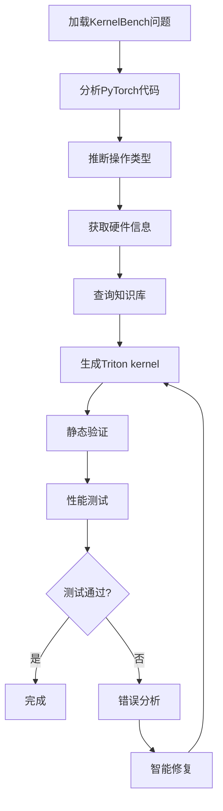

# KernelGen 项目详细分析报告

## 🏗️ 项目架构概览

KernelGen是一个基于LangChain的自动化Triton kernel生成系统，采用分层架构设计：

```
KernelGen/
├── 🎯 Entry Point: generate_kernel.py
├── 📊 Database: KernelBench数据集加载
├── 🔗 Chains: LangChain流程编排
├── 🛠️ Services: 核心业务服务
├── 💬 Prompts: LLM提示模板
├── 🔧 Tools: 性能测试工具
└── 📝 Core: 核心功能模块
```

---

## 📦 核心组件详细分析

### 1. 🔗 Chains Layer (流程编排层)

#### **OrchestrationChain** - 主编排器
**文件**: `src/kernelgen/chains/orchestration_chain.py`

**核心功能**:
- 协调整个kernel生成流程
- 管理多轮迭代优化
- 集成分析、生成、验证三个子链

**关键方法**:
```python
async def generate_kernel(level: int, problem_id: int) -> Dict[str, Any]
    # 主入口，生成指定问题的kernel

async def _execute_iteration(iteration: int, ...) -> IterationResult
    # 执行单次迭代：分析→生成→验证→测试

def _prepare_previous_results() -> Dict[str, Any]
    # 准备上次迭代结果用于错误分析
```

#### **AnalysisChain** - 分析链
**文件**: `src/kernelgen/chains/analysis_chain.py`

**核心功能**:
- 分析PyTorch代码结构
- 推断操作类型和计算模式
- 设计Triton kernel架构

**关键方法**:
```python
async def analyze_operation(pytorch_code, problem_info, iteration=1) -> Dict
    # 统一分析接口：初始分析或错误分析

async def _initial_analysis(pytorch_code, problem_info) -> Dict
    # 首次分析：理解PyTorch模型结构

async def analyze_error_intelligently(error_info, code_context, performance_data) -> Dict
    # 智能错误分析：基于错误信息提供修复建议
```

#### **GenerationChain** - 生成链
**文件**: `src/kernelgen/chains/generation_chain.py`

**核心功能**:
- 基于分析结果生成Triton kernel代码
- 智能修复有问题的代码
- 解析和验证生成的代码

**关键方法**:
```python
async def generate_code(pytorch_code, problem_info, architecture_design, implementation_guidance) -> Dict
    # 生成初始Triton kernel代码

async def fix_code_with_intelligent_analysis(pytorch_code, current_code, error_analysis) -> Dict
    # 智能修复：结合硬件信息和知识库进行修复
```

#### **ValidationChain** - 验证链
**文件**: `src/kernelgen/chains/validation_chain.py`

**核心功能**:
- 验证生成的Triton kernel
- 分析性能和正确性
- 提供优化建议

**关键方法**:
```python
async def validate_kernel(pytorch_code, triton_code, test_results, error_info="") -> Dict
    # 综合验证：静态分析 + LLM分析

async def analyze_performance_optimization(current_code, performance_metrics, target_performance) -> Dict
    # 性能优化分析
```

---

### 2. 🛠️ Services Layer (业务服务层)

#### **HardwareInfoService** - 硬件信息服务
**文件**: `src/kernelgen/services/hardware_service.py`

**核心功能**:
- 检测GPU硬件信息
- 提供硬件优化建议
- 生成硬件上下文字符串

**关键方法**:
```python
def get_current_device_info() -> Dict[str, Any]
    # 获取当前GPU设备信息（真实检测）

def get_hardware_context_string() -> str
    # 生成硬件上下文用于LLM prompt

def get_optimization_recommendations(operation_type: str) -> List[str]
    # 基于硬件特性提供优化建议
```

#### **KnowledgeBaseService** - 知识库服务
**文件**: `src/kernelgen/services/knowledge_service.py`

**核心功能**:
- 加载和管理Triton优化知识库
- 提供操作类型特定的知识
- 生成知识上下文字符串

**关键方法**:
```python
def get_knowledge(operation_type: str) -> Optional[KnowledgeItem]
    # 获取特定操作类型的知识

def get_knowledge_context_string(operation_type: str) -> str
    # 生成知识库上下文用于LLM prompt

def _load_knowledge_base() -> None
    # 从YAML文件加载知识库（真实数据）
```

#### **OperationTypeService** - 操作类型推断服务
**文件**: `src/kernelgen/services/operation_service.py`

**核心功能**:
- 推断PyTorch代码的操作类型
- 提供fallback推断机制
- 计算推断置信度

**关键方法**:
```python
async def infer_operation_type(code: str, operation_name: str = "") -> Dict[str, Any]
    # LLM推断操作类型

def _fallback_inference(code: str) -> Dict[str, Any]
    # 基于关键词的fallback推断（真实匹配）
```

#### **CodeValidationService** - 代码验证服务
**文件**: `src/kernelgen/services/validation_service.py`

**核心功能**:
- 静态验证Triton代码
- 检查语法和约束
- 计算代码质量分数

**关键方法**:
```python
def validate_triton_code(code: str) -> ValidationResult
    # 综合验证Triton代码

def _check_triton_constraints(code: str) -> Tuple[List[str], List[str]]
    # 检查Triton特定约束

def _calculate_quality_score(num_issues, num_warnings, num_suggestions) -> float
    # 基于实际问题计算质量分数（真实评分）
```

---

### 3. 💬 Prompts Layer (提示模板层)

#### **AnalysisPrompts** - 分析提示
**文件**: `src/kernelgen/prompts/analysis_prompts.py`

**核心模板**:
- `INITIAL_ANALYSIS_PROMPT`: 初始PyTorch代码分析
- `DEBUG_ANALYSIS_PROMPT`: 错误调试分析
- `ERROR_ANALYSIS_PROMPT`: 错误原因分析

#### **GenerationPrompts** - 生成提示
**文件**: `src/kernelgen/prompts/generation_prompts.py`

**核心模板**:
- `INITIAL_GENERATION_PROMPT`: 初始代码生成
- `FIX_GENERATION_PROMPT`: 代码修复生成
- `INTELLIGENT_FIX_PROMPT`: 智能修复生成

#### **ValidationPrompts** - 验证提示
**文件**: `src/kernelgen/prompts/validation_prompts.py`

**核心模板**:
- `VALIDATION_PROMPT`: 代码验证和分析

---

### 4. 🔧 Tools Layer (工具层)

#### **PerformanceBenchmarkTool** - 性能测试工具
**文件**: `src/kernelgen/tools/performance_tools.py`

**核心功能**:
- 真实的Triton kernel性能测试
- 与PyTorch基准对比
- 动态阈值验证

**关键方法**:
```python
def _run_performance_test(kernel_code, pytorch_forward, test_inputs, init_inputs) -> Dict
    # 执行真实的性能测试

def _get_dynamic_tolerance(pytorch_result, triton_result) -> Tuple[float, float, str]
    # 基于数值特性动态确定验证阈值
```

---

### 5. 📊 Database Layer (数据层)

#### **KernelBenchLoader** - 数据集加载器
**文件**: `src/kernelgen/database/kernelbench_loader.py`

**核心功能**:
- 加载KernelBench数据集
- 提供问题和测试数据
- 管理数据库连接

---

### 6. 📝 Core Layer (核心层)

#### **IterationLogger** - 迭代日志
**文件**: `src/kernelgen/core/iteration_logger.py`

**核心功能**:
- 记录每次迭代的详细信息
- 生成会话摘要
- 保存生成的kernel代码

#### **TritonPerformanceBenchmark** - 性能基准
**文件**: `src/kernelgen/core/performance_benchmark.py`

**核心功能**:
- 真实的Triton kernel编译和执行
- 性能测试和正确性验证
- 与PyTorch基准对比

---

## 🎯 核心工作流程



---

## 📚 知识库扩充指南

### 当前知识库结构
```yaml
operations:
  operation_type:
    best_practices: []      # 最佳实践
    optimization_tips: []   # 优化技巧
    common_issues: []       # 常见问题
    implementation_patterns: []  # 实现模式
    performance_considerations: []  # 性能考虑
```

### 扩充步骤

#### 1. 添加新操作类型
```yaml
operations:
  new_operation:  # 新操作类型
    best_practices:
      - "新操作的最佳实践1"
      - "新操作的最佳实践2"
    
    optimization_tips:
      - "优化技巧1"
      - "优化技巧2"
    
    common_issues:
      - "常见问题1"
      - "常见问题2"
    
    implementation_patterns:
      - "实现模式1"
      - "实现模式2"
    
    performance_considerations:
      - "性能考虑1"
      - "性能考虑2"
```

#### 2. 扩充现有操作类型
在现有操作类型下添加更多条目：
```yaml
operations:
  matmul:
    best_practices:
      - "现有实践..."
      - "新增最佳实践"  # 新增
    
    optimization_tips:
      - "现有技巧..."
      - "新的优化技巧"  # 新增
```

#### 3. 添加硬件特定优化
```yaml
operations:
  matmul:
    hardware_specific:
      A100:
        - "A100特定优化1"
        - "A100特定优化2"
      V100:
        - "V100特定优化1"
        - "V100特定优化2"
```

#### 4. 添加复合操作
```yaml
operations:
  conv2d_relu_bias:  # 复合操作
    base_operations: ["conv2d", "elementwise"]  # 基础操作
    fusion_strategies:
      - "操作融合策略1"
      - "操作融合策略2"
    
    best_practices:
      - "复合操作最佳实践"
```

### 知识库使用流程

1. **自动加载**: `KnowledgeBaseService`在初始化时自动加载YAML文件
2. **类型匹配**: 根据`OperationTypeService`推断的操作类型查询知识
3. **上下文生成**: 将知识转换为LLM可理解的上下文字符串
4. **提示注入**: 在分析和生成阶段注入相关知识

### 扩充建议

1. **基于实际问题**: 根据生成失败的案例添加相应知识
2. **硬件特异性**: 针对不同GPU架构添加特定优化
3. **性能模式**: 添加不同性能目标的优化策略
4. **错误模式**: 基于常见错误添加避免策略
5. **最新技术**: 跟进Triton新特性和优化技巧

---

## 🚀 系统特点

### ✅ 优势
1. **真实数据驱动**: 所有服务使用真实的硬件检测、知识库加载、代码分析
2. **模块化设计**: 清晰的分层架构，易于维护和扩展
3. **智能迭代**: 基于错误分析的智能修复机制
4. **知识驱动**: 可扩展的知识库系统
5. **性能验证**: 真实的性能测试和正确性验证

### 🎯 扩展方向
1. **知识库丰富**: 添加更多操作类型和优化策略
2. **硬件适配**: 支持更多GPU架构
3. **算法优化**: 改进代码生成和修复算法
4. **用户界面**: 添加Web界面或CLI工具
5. **缓存机制**: 添加生成结果缓存

这个系统为自动化Triton kernel生成提供了完整的解决方案，具有良好的扩展性和实用性。